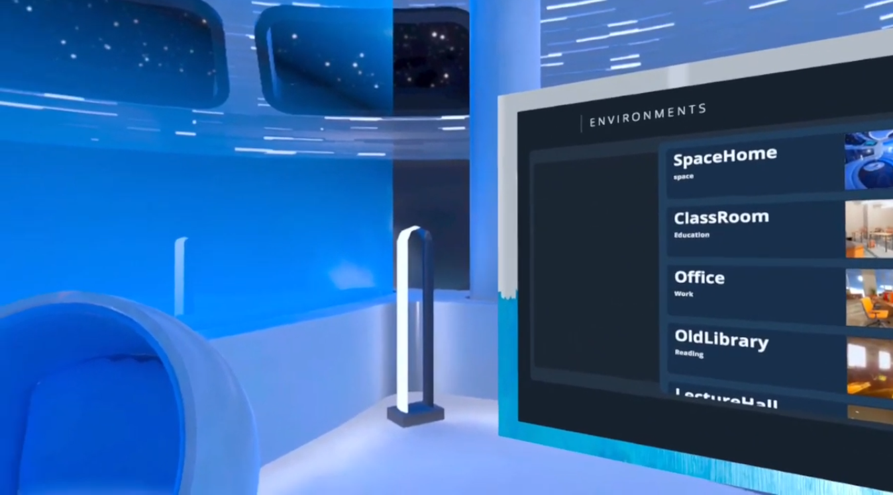
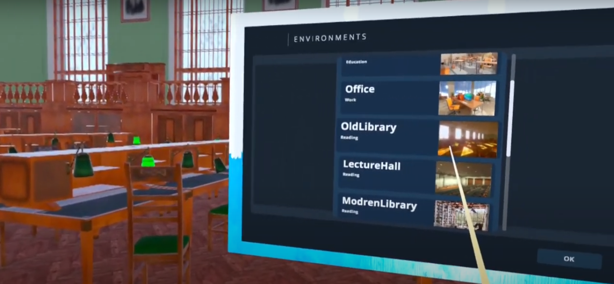
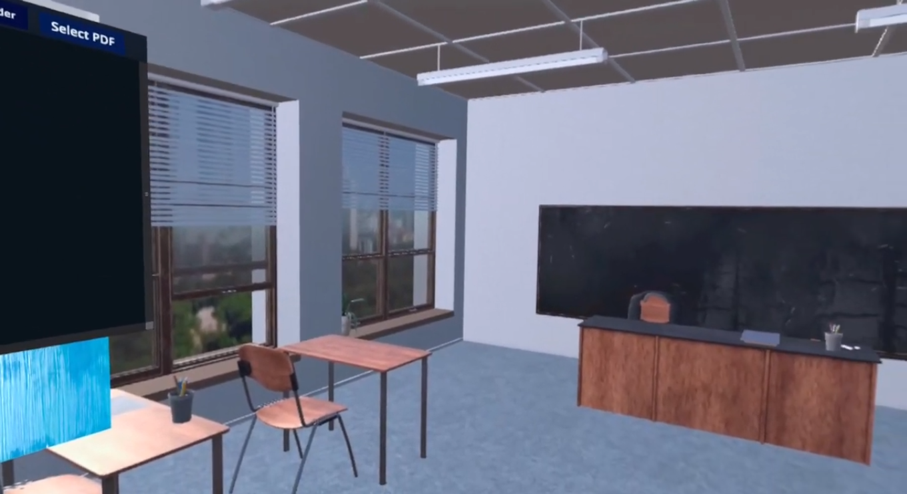

# VR E-Book Reader

**Step into an immersive world of reading like never before with VR E-Book Reader! Explore captivating virtual environments while enjoying your favorite books, brought to you by VRBook Studio.**

## 📌 Table of Contents

1. [About the Project](#about-the-project)
2. [E-Book Reader Details](#e-book-reader-details)
3. [Installation](#installation)
4. [Usage](#usage)
5. [Contribution](#contribution)
6. [License](#license)
7. [Contact](#contact)
8. [Acknowledgements](#acknowledgements)

## 📚 About the Project

VR E-Book Reader is more than just an e-book reader; it's an immersive reading experience in the world of virtual reality. Dive into your favorite books while exploring captivating virtual environments that enhance your reading journey. This project reimagines the way we read books.

## 🌌 E-Book Reader Details

### Description

- **Immersive Reading Environments**: Experience your e-books in beautifully designed virtual settings, from serene libraries to breathtaking landscapes.
- **Interactive Reading**: Engage with your e-books through gestures, turning pages, and interacting with the virtual world around you.
- **Personalized Reading Experience**: Customize your reading environment and preferences to suit your style.

### Key Features

- **Full VR Reading**: Immerse yourself in a virtual reading world that amplifies the joy of reading.
- **Stunning Visuals**: Enjoy visually stunning environments that bring your books to life.
- **Social Reading**: Share your reading experiences with friends in the virtual world.

### Gallery

## 💻 Installation

**Follow these instructions to set up VR E-Book Reader:**

1. **Requirements**
   - VR headset (e.g., Oculus Rift, HTC Vive)
   - Compatible VR-ready PC or gaming console
2. **Setup**
   - Download the VR E-Book Reader setup file from the releases section.
   - Install the application following the on-screen instructions.

## 📖 Usage

**Here's how to get started with VR E-Book Reader:**

1. Put on your VR headset and ensure it's properly calibrated.
2. Launch the application from your VR platform.
3. Choose your preferred reading environment and e-book.
4. Interact with your e-book, turn pages, and explore the virtual world while reading.

## 🤝 Contribution

We welcome contributions from the VR and literature communities. If you'd like to contribute, please fork the repository and create a new pull request.

## 📄 License

Distributed under the XYZ License. See `LICENSE` for more information.

## 📞 Contact

Xrev Studio
- Email: contact@xrevtudio.com
- Twitter: [@XREVStudio](https://twitter.com/VRBookStudio)

## 👏 Acknowledgements

- [Unity Engine](https://unity.com/)
- [Oculus SDK](https://developer.oculus.com/)
